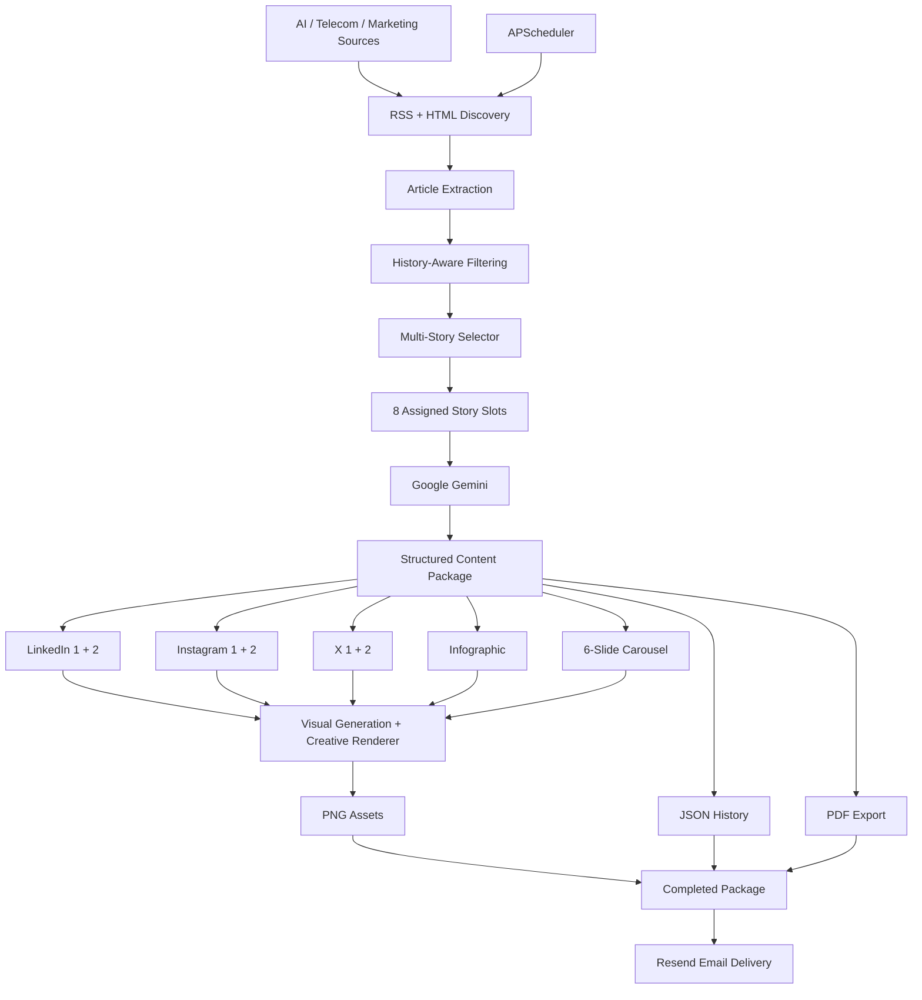
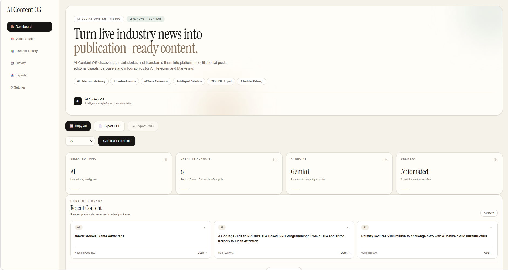
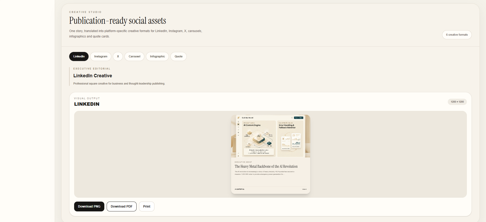
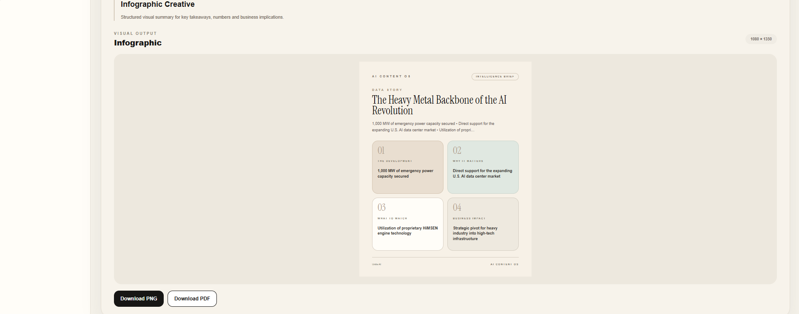
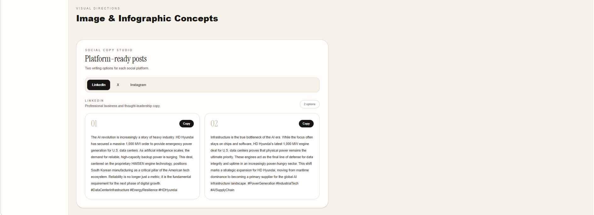

# AI Content OS

> **Live industry intelligence → multi-story AI content → production-ready creative assets → scheduled delivery**

AI Content OS is a deployed full-stack Generative AI content automation platform that turns current industry news into differentiated, platform-specific content packages for **AI, Telecom, and Marketing**.

Unlike a simple “one article → many posts” workflow, AI Content OS selects multiple fresh stories, assigns them to independent content slots, generates grounded copy and visual directions, renders editorial creative assets, stores the package, exports it to PDF, and can deliver the completed package automatically by email.

## Live Product

- **Frontend:** https://ai-content-os-lake.vercel.app
- **Backend API:** https://ai-content-os-api.onrender.com
- **Interactive API Docs:** https://ai-content-os-api.onrender.com/docs

> The Render backend may require a brief warm-up after inactivity.

## What It Generates

Each content package can assign **8 distinct news stories**:

| Slot | Output |
| --- | --- |
| LinkedIn 1 | Headline, insight, post, visual direction, finished creative |
| LinkedIn 2 | Headline, insight, post, visual direction, finished creative |
| Instagram 1 | Headline, insight, caption, visual direction, finished creative |
| Instagram 2 | Headline, insight, caption, visual direction, finished creative |
| X 1 | Headline, insight, post, visual direction, finished creative |
| X 2 | Headline, insight, post, visual direction, finished creative |
| Infographic | Dedicated story, headline, subtitle, four points, 1080 × 1350 asset |
| Carousel | Dedicated story, headline, six editorial slides |

The selector prioritizes different stories and publisher diversity while using content history to reduce repetition across runs.

## End-to-End Workflow

```text
Live RSS + news sources
        ↓
Article discovery and extraction
        ↓
History-aware duplicate filtering
        ↓
Multi-story selection and slot assignment
        ↓
Google Gemini structured generation
        ↓
Strict story isolation per output
        ↓
Platform visual generation
        ↓
Backend editorial creative rendering
        ↓
LinkedIn ×2 | Instagram ×2 | X ×2
Infographic ×1 | Carousel ×6
        ↓
JSON history + PDF
        ↓
Scheduled Resend email delivery
```

## Key Capabilities

### Multi-Source Industry Intelligence

AI Content OS discovers current stories across **AI, Telecom, and Marketing** using RSS feeds and HTML-based source discovery.

The active AI source pool includes publishers such as:

- OpenAI
- Anthropic
- Google DeepMind
- Microsoft AI
- Google AI Blog
- Hugging Face Blog
- VentureBeat AI
- MarkTechPost

Telecom and Marketing use separate topic-specific publisher pools.

### Multi-Story Content Architecture

The application does not simply rewrite one article for every channel.

A package assigns separate stories to:

- 2 LinkedIn outputs
- 2 Instagram outputs
- 2 X outputs
- 1 infographic
- 1 carousel

Where the available source pool permits it, publisher diversity is also prioritized.

### Story Isolation and Grounding

Each generated output is constrained to its assigned article.

The prompt architecture explicitly prevents unrelated stories from being intentionally mixed across headlines, posts, captions, infographic points, carousel slides, insights, and visual directions.

If source material is limited, the model is instructed to remain conservative rather than invent unsupported details or borrow information from another story.

### Platform-Specific Content Generation

Google Gemini generates structured JSON with channel-specific requirements:

- **LinkedIn:** executive/business intelligence style
- **Instagram:** concise editorial and conversational captions
- **X:** short-form news intelligence
- **Infographic:** headline, subtitle, and exactly four concise points
- **Carousel:** headline and exactly six structured slides

The structured response is normalized into a reusable content package for downstream rendering, history, export, and delivery.

### Six Independent Social Creatives

The backend creates two variants for each social platform:

- LinkedIn Creative 1
- LinkedIn Creative 2
- Instagram Creative 1
- Instagram Creative 2
- X Creative 1
- X Creative 2

Each finished creative combines generated imagery with editorial typography, story-specific headlines, insights, source attribution, and platform-specific dimensions.

### Responsive Infographic Rendering

A dedicated story is transformed into a **1080 × 1350** editorial infographic containing four structured information cards.

The renderer dynamically fits longer body copy to the available card area, preventing variable-length Telecom, AI, or Marketing content from overflowing the design.

### Six-Slide Editorial Carousel

A separate story is transformed into six square editorial slides:

1. The Big Idea
2. The Development
3. Why It Matters
4. What to Watch
5. Business Impact
6. The Takeaway

The carousel is independent from the six social-post stories and is rendered as individual visual assets.

### History and Repetition Control

Generated packages are persisted as JSON history.

Recent:

- article titles
- article links
- sources

are tracked and used during selection to reduce repetitive daily output.

### Automated Daily Delivery

APScheduler runs the production workflow on a daily schedule using the **Asia/Kolkata** timezone.

For each topic, the scheduled pipeline performs:

```text
Fresh package generation
→ 6 raw social images
→ 6 finished social creatives
→ infographic
→ 6 carousel slides
→ exact package reload
→ PDF creation
→ Resend email
```

The scheduler includes duplicate-run protection and avoids intentionally sending an older package when fresh generation fails.

## Architecture



## Technology Stack

| Layer | Technologies |
| --- | --- |
| Frontend | Next.js 16, React, TypeScript, Tailwind CSS |
| Backend | Python, FastAPI, Uvicorn |
| Generative AI | Google Gemini / Google Gen AI SDK |
| Content Discovery | RSS, Feedparser, Requests, Beautiful Soup |
| Visual Generation | Image-generation API integration |
| Creative Rendering | Pillow |
| PDF Export | ReportLab |
| Email Delivery | Resend |
| Automation | APScheduler |
| Persistence | JSON-based content history |
| Deployment | Vercel, Render |
| Engineering | REST APIs, CORS, environment variables, Git/GitHub |

## Product Screenshots

### Intelligence Dashboard

Generate content from current industry news, choose AI, Telecom, or Marketing, manage saved packages, and access the automated content workflow.



---

### Creative Studio

Review and export platform-specific visual assets for LinkedIn, Instagram, X, carousel, infographic, and other editorial formats.



---

### Editorial Carousel Studio

Generate a publication-style six-slide visual story with individual visual assets.


---

### Infographic Studio

Convert a dedicated news story into a structured 1080 × 1350 editorial infographic.



---

### Social Copy Studio

Generate two differentiated writing options for LinkedIn, Instagram, and X.



## Representative API Endpoints

| Method | Endpoint | Purpose |
| --- | --- | --- |
| GET | `/` | API status |
| GET | `/package/daily?topic=ai` | Generate a fresh multi-story package |
| GET | `/history/` | List saved packages |
| GET | `/history/{filename}` | Load a saved package |
| DELETE | `/history/{filename}` | Delete a saved package |
| GET | `/image/generate` | Generate a platform visual |
| GET | `/export/latest-pdf` | Download the latest backend-generated PDF |
| GET | `/email/test` | Test email delivery |
| GET | `/email/send-latest` | Email the latest package |
| GET | `/scheduler/status` | View scheduler status |

## Local Installation

### Backend

```bash
git clone https://github.com/yogeshsinghrf-alt/AI-Content-OS.git
cd AI-Content-OS/backend
python -m venv venv
```

Windows activation:

```powershell
venv\Scripts\activate
```

Install dependencies and start the API:

```bash
pip install -r requirements.txt
uvicorn main:app --reload
```

Create `backend/.env`:

```env
GEMINI_API_KEY=your_gemini_api_key
RESEND_API_KEY=your_resend_api_key
RESEND_FROM=AI Content OS <onboarding@resend.dev>
EMAIL_TO=your_email_address
SCHEDULER_SECRET=your_scheduler_secret
```

Add any image-generation provider key required by your configured visual-generation service.

### Frontend

```bash
cd frontend
npm install
npm run dev
```

Create `frontend/.env.local`:

```env
NEXT_PUBLIC_API_URL=http://127.0.0.1:8000
```

## Production Configuration

### Render

Configure the backend secrets required by the deployed environment, including:

```text
GEMINI_API_KEY
RESEND_API_KEY
RESEND_FROM
EMAIL_TO
SCHEDULER_SECRET
```

### Vercel

```text
NEXT_PUBLIC_API_URL
```

Set it to the deployed Render backend URL.

## Reliability and Engineering Decisions

Several implementation choices are intentionally production-oriented:

- **Fresh-package safety:** scheduled runs do not intentionally email an older package when fresh generation fails.
- **Duplicate-run protection:** concurrent scheduler requests are rejected while a run is active.
- **History-aware selection:** recently used titles and links are filtered to reduce repetition.
- **Graceful source failure:** one inaccessible publisher does not stop the complete discovery pipeline.
- **Story isolation:** each output is grounded in its assigned story.
- **Responsive text rendering:** long infographic copy is fitted to the available design area.
- **Exact-package delivery:** downstream assets, PDF creation, and email use the package generated during that run.
- **Environment-based secrets:** API credentials and delivery configuration remain outside source code.

## Engineering Work Demonstrated

- Full-stack AI application development
- Multi-source news ingestion
- HTML and RSS content discovery
- Article extraction and normalization
- LLM prompt engineering
- Structured JSON generation
- Multi-story assignment and deduplication
- Retrieval-grounded content transformation
- Backend image and creative rendering
- Programmatic infographic generation
- Programmatic carousel generation
- PDF generation
- Persistent content history
- APScheduler workflow automation
- Transactional email integration
- AI service error and quota handling
- REST API design
- Production frontend/backend deployment
- Environment and secret management
- Git/GitHub development workflow

## Validation Status

The current build has been tested across **AI, Telecom, and Marketing**.

| Capability | Status |
| --- | --- |
| Production frontend | Working |
| Production backend | Working |
| Gemini content generation | Working |
| Multi-topic news discovery | Working |
| Multi-story selection | Working |
| History-aware repetition control | Working |
| LinkedIn options 1 + 2 | Working |
| Instagram options 1 + 2 | Working |
| X options 1 + 2 | Working |
| Six finished social creatives | Working |
| Dedicated infographic story | Working |
| Responsive infographic layout | Working |
| Dedicated carousel story | Working |
| Six carousel slides | Working |
| JSON content history | Working |
| Backend PDF generation | Working |
| Resend email delivery | Working |
| Daily scheduler | Working |
| Duplicate scheduler protection | Working |
| AI → Telecom → Marketing scheduled workflow | Tested successfully |

## Known Limitations

- Some publishers use anti-bot protections that can reject direct HTML discovery.
- Meta AI and World Economic Forum AI discovery require additional hardening before being enabled as reliable production sources.
- JSON history is suitable for the current portfolio/single-user implementation but would need database-backed persistence for a multi-user product.
- Direct publishing to LinkedIn, Instagram, and X is not yet implemented.

## Roadmap

- Harden additional publisher adapters, including Meta AI and World Economic Forum AI
- Direct LinkedIn, Instagram, and X publishing integrations
- Database-backed persistence
- Authentication and multi-user workspaces
- Human approval workflows
- Content calendar
- Brand-template management
- Performance analytics and feedback loops
- Advanced scheduling controls
- Additional industry/source packs

## Why This Project Matters

AI Content OS is more than a prompt interface.

It combines **live information retrieval, multi-story selection, grounded generative AI, visual production, persistence, document export, scheduling, and automated delivery** into an end-to-end software workflow.

The project demonstrates how an LLM can operate as one component inside a broader production system rather than being the entire product.

## Author

**Yogesh Singh**

Telecom transformation professional with 20+ years of international experience, expanding into AI, Generative AI, and AI-enabled digital transformation.

---

**AI Content OS — from live industry signals to differentiated, publishable content.**
