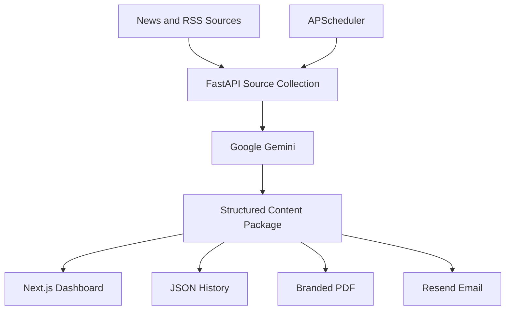

AI Content OS


AI Content OS is a deployed full-stack Generative AI platform that discovers current industry news and transforms it into structured, platform-specific social content.
It supports AI, Telecom and Marketing topics and generates LinkedIn posts, X posts, Instagram captions, editorial headlines, visual directions, branded PDF reports and automated email packages.
Live Demo
Frontend: https://ai-content-os-lake.vercel.app
Backend API: https://ai-content-os-api.onrender.com
Interactive API Documentation: https://ai-content-os-api.onrender.com/docs
> The Render service may require a brief warm-up after inactivity.
Business Problem
Creating timely, differentiated content across multiple social channels requires continuous research, rewriting, formatting and asset preparation. AI Content OS centralizes that workflow by converting live source material into a reusable daily content package.
Key Features
Live news and RSS discovery across AI, Telecom and Marketing sources
Google Gemini-based structured content generation
Two LinkedIn posts, two X posts and two Instagram captions
Editorial headline, subtitle, quote card and infographic points
Hero, editorial, Instagram and infographic visual directions
Searchable content history with reload and delete actions
Branded PDF generation using ReportLab
HTML email delivery with PDF attachments through Resend
Daily workflow scheduling through APScheduler
Responsive Next.js dashboard
Production deployment using Vercel and Render
Architecture

Technology Stack
Layer	Technologies
Frontend	Next.js, React, TypeScript, CSS, Vercel
Backend	Python, FastAPI, Uvicorn, Google Gen AI SDK
Automation	APScheduler, RSS/Feedparser, Beautiful Soup
Documents & Email	ReportLab, Resend
Deployment	Render, Vercel, GitHub
Engineering	REST APIs, environment variables, CORS, Git
Generated Content Package
A package can contain:
Two LinkedIn posts
Two X posts
Two Instagram captions
Editorial headline and subtitle
Quote card
Infographic points
Four visual-generation directions
Source publication, article title and article link
API Endpoints
Method	Endpoint	Purpose
GET	`/`	API status
GET	`/package/daily?topic=ai`	Generate a content package
GET	`/history/`	List saved packages
GET	`/history/{filename}`	Load a saved package
DELETE	`/history/{filename}`	Delete a saved package
GET	`/export/latest-pdf`	Download the latest branded PDF
GET	`/email/test`	Test Resend delivery
GET	`/email/send-latest`	Email the latest package with PDF
GET	`/scheduler/status`	View scheduler status
GET	`/scheduler/test-ai`	Run the AI pipeline manually
Local Installation
Backend
```bash
git clone https://github.com/yogeshsinghrf-alt/AI-Content-OS.git
cd AI-Content-OS/backend
python -m venv venv
```
Windows activation:
```powershell
venv\Scripts\activate
```
Install and run:
```bash
pip install -r requirements.txt
uvicorn main:app --reload
```
Create `backend/.env`:
```env
GEMINI_API_KEY=your_gemini_api_key
RESEND_API_KEY=your_resend_api_key
RESEND_FROM=AI Content OS <onboarding@resend.dev>
EMAIL_TO=your_email_address
```
Frontend
```bash
cd frontend
npm install
npm run dev
```
Create `frontend/.env.local`:
```env
NEXT_PUBLIC_API_URL=http://127.0.0.1:8000
```
Production Configuration
Render
```text
GEMINI_API_KEY
RESEND_API_KEY
RESEND_FROM
EMAIL_TO
```
Vercel
```text
NEXT_PUBLIC_API_URL
```
Current Status
Capability	Status
Frontend deployment	Working
Backend deployment	Working
AI generation	Working
Content history	Working
PDF generation	Working
Resend email delivery	Working
Scheduler implementation	Completed
Scheduled daily-run verification	Pending
Engineering Outcomes
Built and deployed a production-style AI automation application.
Integrated Google Gemini for schema-driven content generation.
Developed a FastAPI backend and responsive Next.js frontend.
Automated PDF creation and API-based email delivery.
Implemented persistence, history management and scheduled workflows.
Resolved production dependency, CORS, environment and cloud-networking issues.
Roadmap
Social-platform publishing integrations
Database-backed persistence
Authentication and multi-user workspaces
Approval workflows and content calendars
Analytics and performance tracking
Brand templates and advanced scheduling controls
Author
Yogesh Singh  
Google AI Certified telecom transformation professional with 20+ years of international experience, transitioning into AI, Generative AI and AI-enabled digital transformation roles.