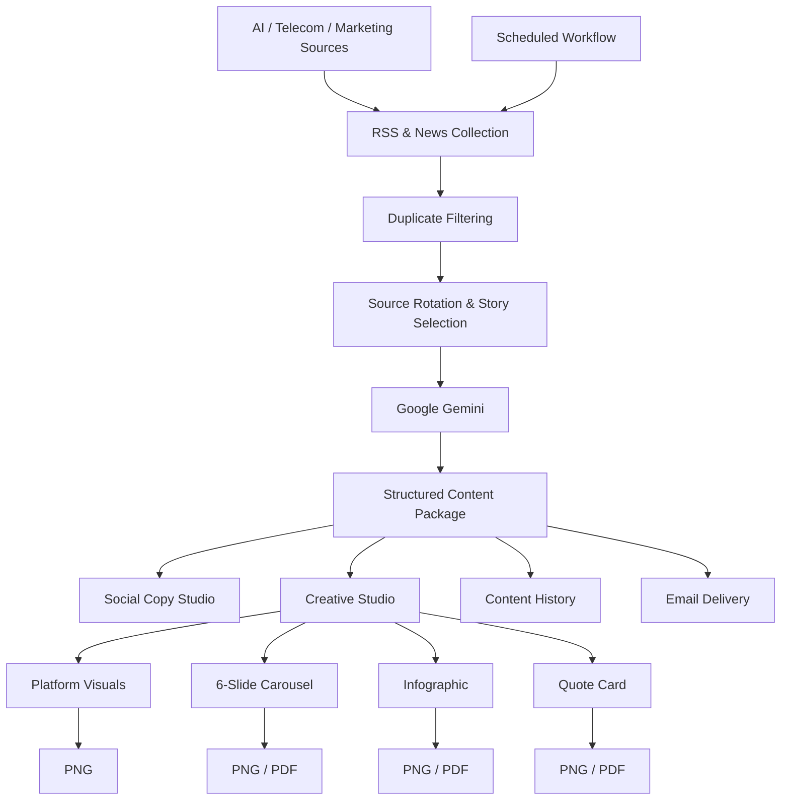

# AI Content OS

> **Live industry intelligence → publication-ready multi-platform content**


AI Content OS is a deployed full-stack Generative AI content automation platform that discovers current industry news and transforms it into structured, platform-specific social content and publication-ready creative assets.

It supports **AI, Telecom and Marketing** and combines live-source discovery, Google Gemini generation, visual creation, editorial design, content history, export and automated delivery in one workflow.

## Live Product

- **Frontend:** https://ai-content-os-lake.vercel.app
- **Backend API:** https://ai-content-os-api.onrender.com
- **Interactive API Docs:** https://ai-content-os-api.onrender.com/docs

> The Render backend may require a brief warm-up after inactivity.

## Business Problem

Creating timely, differentiated content across multiple social platforms normally requires continuous research, source selection, rewriting, visual ideation, formatting, asset preparation and distribution.

AI Content OS brings those activities into one reusable workflow:

```text
Live industry news
        ↓
Source collection & selection
        ↓
Duplicate / repetition control
        ↓
Google Gemini content intelligence
        ↓
Platform-specific copy
        ↓
Creative Studio
        ↓
PNG / PDF / History / Email
```

## What It Generates

A generated package can include:

- 2 LinkedIn post options
- 2 X post options
- 2 Instagram caption options
- Editorial headline and subtitle
- Original insight / quote card
- Structured infographic points
- Platform-specific visual assets
- 6-slide editorial carousel
- 1080 × 1350 infographic
- 1080 × 1080 quote card
- Source publication, article title and original article link

## Key Capabilities

### Live Industry Intelligence
Collects current stories from multiple RSS/news sources across **AI, Telecom and Marketing**.

### Source Diversity & Content Rotation
Uses source rotation, duplicate-title filtering and history-aware selection logic to reduce repetitive daily content.

### Gemini-Powered Content Generation
Uses Google Gemini to transform selected stories into structured content with platform-specific tone, length and positioning.

### Social Copy Studio
Organizes generated copy into dedicated **LinkedIn, X and Instagram** views, with two alternatives for each platform.

### Creative Studio
Provides platform-oriented creative formats for **LinkedIn, Instagram, X, Carousel, Infographic and Quote**.

### 6-Slide Editorial Carousel
Structures a story as:

1. Intelligence Brief
2. What Happened
3. Why It Matters
4. What to Watch
5. Business Impact
6. Takeaway

Individual slides can be exported as PNG and the complete carousel as PDF.

### Infographic Studio
Transforms the story into a **1080 × 1350** editorial infographic covering the development, why it matters, what to watch and business impact. Supports PNG and PDF export.

### Quote Card
Creates a dedicated **1080 × 1080** editorial insight card with PNG and PDF export.

### Content History
Generated packages are persisted to history and can be reopened or deleted from the dashboard.

### Automated Delivery
Automated daily workflow scheduling is implemented and tested, with Resend-based email delivery for generated content packages.

## Architecture



## Technology Stack

| Layer | Technologies |
|---|---|
| Frontend | Next.js 16, React, TypeScript, Tailwind CSS |
| Backend | Python, FastAPI, Uvicorn |
| Generative AI | Google Gemini / Google Gen AI SDK |
| Content Discovery | RSS, Feedparser, Beautiful Soup |
| Visual Export | html-to-image, jsPDF |
| Documents & Email | ReportLab, Resend |
| Automation | APScheduler, GitHub Actions workflow |
| Persistence | JSON-based content history |
| Deployment | Vercel, Render |
| Engineering | REST APIs, CORS, environment variables, Git/GitHub |

## Product Screenshots

Add final screenshots from the production dashboard before sharing the repository widely.

Recommended screenshots:

1. **Dashboard** — product header, topic selector and stats
2. **Creative Studio** — generated platform visual
3. **Carousel Studio** — multiple editorial slides
4. **Infographic + Social Copy Studio** — exportable visual and platform-specific copy

Suggested structure:

```text
docs/
└── screenshots/
    ├── dashboard.png
    ├── creative-studio.png
    ├── carousel-studio.png
    └── infographic-social-copy.png
```

Then embed them in this section using repository-relative image paths.

## API Endpoints

| Method | Endpoint | Purpose |
|---|---|---|
| GET | `/` | API status |
| GET | `/package/daily?topic=ai` | Generate a content package |
| GET | `/history/` | List saved packages |
| GET | `/history/{filename}` | Load a saved package |
| DELETE | `/history/{filename}` | Delete a saved package |
| GET | `/image/generate` | Generate a platform visual |
| GET | `/export/latest-pdf` | Download the latest backend-generated PDF |
| GET | `/email/test` | Test email delivery |
| GET | `/email/send-latest` | Email the latest package |
| GET | `/scheduler/status` | View scheduler status |
| GET | `/scheduler/test-ai` | Run the AI pipeline manually |

## Local Installation

### Backend

```bash
git clone https://github.com/yogeshsinghrf-alt/AI-Content-OS.git
cd AI-Content-OS/backend
python -m venv venv
```

Windows activation:

```powershell
venv\Scripts\activate
```

Install and run:

```bash
pip install -r requirements.txt
uvicorn main:app --reload
```

Create `backend/.env`:

```env
GEMINI_API_KEY=your_gemini_api_key
RESEND_API_KEY=your_resend_api_key
RESEND_FROM=AI Content OS <onboarding@resend.dev>
EMAIL_TO=your_email_address
```

### Frontend

```bash
cd frontend
npm install
npm run dev
```

Create `frontend/.env.local`:

```env
NEXT_PUBLIC_API_URL=http://127.0.0.1:8000
```

## Production Configuration

### Render

```text
GEMINI_API_KEY
RESEND_API_KEY
RESEND_FROM
EMAIL_TO
```

### Vercel

```text
NEXT_PUBLIC_API_URL
```

Set it to the deployed Render backend URL.

## Engineering Work Demonstrated

- Full-stack AI application development
- LLM prompt and structured-output design
- REST API integration
- Live RSS/news ingestion
- Source selection and repetition control
- Platform-specific content generation
- AI-assisted visual workflows
- Client-side PNG/PDF generation
- Persistent content history
- Tested scheduled daily automation
- Transactional email integration
- Environment-variable and secret management
- CORS and frontend/backend integration
- Production deployment and debugging
- Git/GitHub development workflow

## Current Status

| Capability | Status |
|---|---|
| Production frontend | Working |
| Production backend | Working |
| Gemini content generation | Working |
| Multi-topic news discovery | Working |
| Content rotation / duplicate filtering | Working |
| Social copy generation | Working |
| Platform visual generation | Working |
| 6-slide carousel | Working |
| Infographic | Working |
| Quote card | Working |
| PNG/PDF creative export | Working |
| Content history | Working |
| Resend email delivery | Working |
| Scheduler implementation | Working |
| Scheduled daily-run verification | Tested successfully |

## Roadmap

- Direct LinkedIn, Instagram and X publishing integrations
- Database-backed persistence
- Authentication and multi-user workspaces
- Human approval workflows
- Content calendar
- Brand-template management
- Performance analytics
- Advanced scheduling controls
- Additional industry/source packs

## Why This Project Matters

AI Content OS is designed as more than a prompt interface. It combines **live information retrieval, generative AI, content transformation, visual production, persistence, export and automation** into an end-to-end business workflow.

## Author

**Yogesh Singh**

Telecom transformation professional with 20+ years of international experience, expanding into AI, Generative AI and AI-enabled digital transformation.

---

**AI Content OS — from live industry signal to publishable content.**
